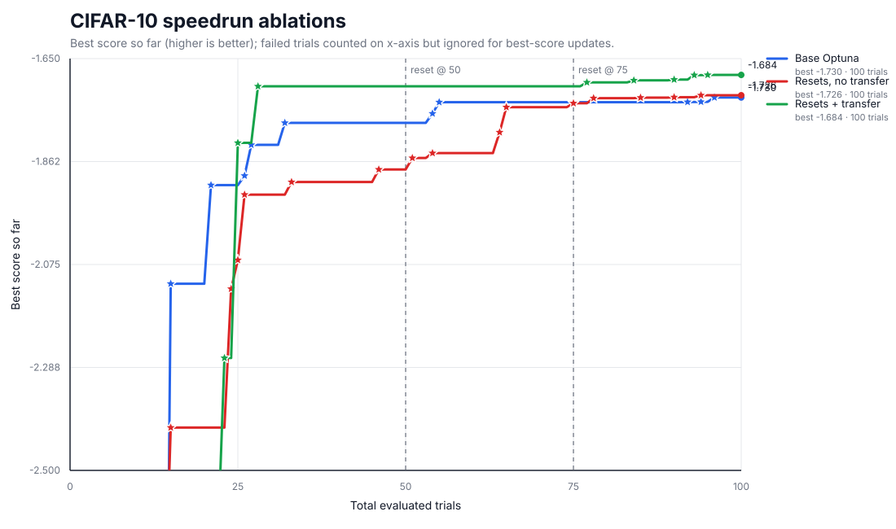
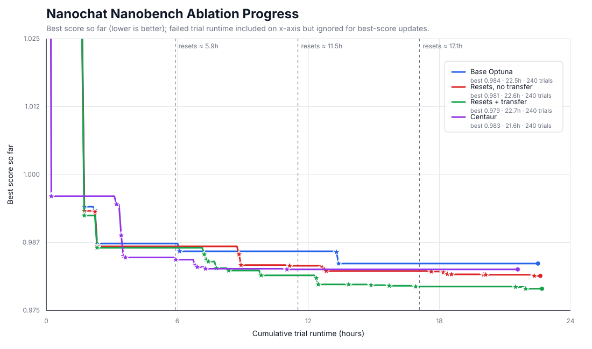

<p align="center">
  
</p>

<h1 align="center">Autotune</h1>

<p align="center">
  Agent-assisted hyperparameter optimization for scripts that report one metric line.
</p>

<p align="center">
  
  
  
</p>

Autotune combines `headless` agents with Optuna. It analyzes your script, proposes a search space, asks for confirmation, generates a safe trial runner, and executes trials without modifying the original script. If your script is missing CLI parsing or metric output, Autotune can ask the agent to generate a compatible copy for the run.

https://github.com/user-attachments/assets/027e679f-01d1-4e03-ab5f-39022c6a477b

## How It Works

Autotune operates in clear phases:

1. **Prerequisites**: resolves Python, provisions the optimization controller when needed, checks the selected Headless agent, and verifies the target runtime.
2. **Analysis**: asks the agent to inspect your script and propose tunable parameters, direction, sampler, and pruner.
3. **Confirmation**: shows the proposed space and accepts `Y`, `feedback`, `edit`, or `n`.
4. **Compatibility**: when needed, generates a modified copy that adds CLI flags or `autotune_metric`.
5. **Optuna Run**: writes a Python runner, launches trials, reports progress, and stores results.
6. **Refinement**: optionally runs extra agentic rounds that revise the search space from completed trial evidence.

The original script is left untouched.

## Run

Requirements: Node.js 22 or newer with npm/npx, Python 3.9 or newer, and registry access on the first uncached run. Python must provide `venv` with pip unless `uv` is available. No global Autotune, Headless, Optuna, or `cmaes` installation is required:

```bash
npx -y @roberttlange/autotune --help
npx -y @roberttlange/autotune doctor --agent codex
npx -y @roberttlange/autotune run train.py --trials 20 --agent codex
```

Optional global CLI installation:

```bash
npm install -g @roberttlange/autotune
autotune --help
```

### Agent Skill

The optional Autotune agent skill is maintained in this repository rather than bundled in the npm package. Install it globally for Codex from GitHub:

```bash
npx skills add RobertTLange/autotune --skill autotune --agent codex --global
```

## Core Usage

```bash
npx -y @roberttlange/autotune run train.py --trials 50 --agent codex
```

The remaining examples use `autotune` for readability; substitute `npx -y @roberttlange/autotune` when using the zero-install form.

Common flags:

```bash
autotune run train.py \
  --trials 50 \
  --agent codex \
  --model gpt-5.5 \
  --reasoning-effort high \
  --agent-guidance "prefer optimizer and regularization parameters" \
  --max-parameters 3 \
  --sampler tpe \
  --pruner none \
  --n-jobs 1 \
  --time-budget-seconds 86400 \
  --output results.json
```

Use `--effort low|medium|high|xhigh` as a shorter alias for `--reasoning-effort`.

When `--direction`, `--sampler`, or `--pruner` are omitted, Autotune uses the agent-proposed settings from the confirmed search space. Explicit CLI flags override agent proposals.

Use `--agent-guidance <text>` or `--agent-guidance-file <file>` to add advisory instructions for search-space generation and refinement, such as parameters to prefer or avoid. If both are provided, file guidance is applied first and inline guidance is appended. Guidance does not apply to modified-script generation and cannot override schema, metric comparability, or objective-measurement constraints. Guidance is sent to the agent and stored in prompt artifacts; guidance files must be regular files no larger than 65536 bytes.

Use `--max-parameters <n>` with `run` or `analyze` to cap the number of active Optuna search parameters. Fixed parameters do not count toward the cap. Autotune asks the agent to prioritize the highest-impact parameters; if an agent response exceeds the cap, it requests one correction and then fails if the corrected response is still over the limit. Predefined configs and manually edited spaces fail immediately when they exceed the cap.

## Commands

```bash
autotune analyze <script> [--agent codex] [--model MODEL] [--reasoning-effort high] [--max-parameters N]
autotune doctor [script] [--agent codex]
autotune run <script> --trials N [--agent codex] [--model MODEL] [--reasoning-effort high] [--max-parameters N]
autotune results [autotune|run-dir|results.json] [--top 10] [--json]
autotune plot-progress <ablation-run-dir> --output progress.svg
autotune resume --storage sqlite:///study.db --trials N
```

Use `doctor` to verify prerequisites before a run:

```bash
autotune doctor examples/mnist/mnist_cnn.py --agent codex
```

Use built-in help for full flag details:

```bash
autotune --help
autotune run --help
autotune results --help
```

## Runtime Commands

Use a custom runtime command without invoking a shell:

```bash
autotune run train.jl --trials 30 --command "julia +nightly"
```

Run a build step once before analysis and trials:

```bash
autotune run model.cpp \
  --build-command "g++ -std=c++17 -O2 {script} -o {work-dir}/model" \
  --command "{work-dir}/model" \
  --trials 30
```

`--build-command` and `--command` support `{script}` and `{work-dir}` placeholders.

Skip analysis with a known search space:

```bash
autotune run train.py --trials 20 --config search_space.yaml --yes
```

## Agentic Refinement

Run multiple refinement rounds:

```bash
autotune run train.py \
  --trials 20 \
  --refine-rounds 2 \
  --refine-trials 10 \
  --refine-mode ask
```

After each round, Autotune summarizes completed trials and asks the agent to revise the search space. The agent may narrow promising ranges, broaden ranges when best values sit near bounds, or add/remove variables when justified by the script and trial evidence. `--refine-mode ask` asks for approval before each revised space; `--refine-mode auto` accepts revised spaces automatically.

Useful parameters and completed trials transfer between rounds by default. Each round gets its own search space, results, runner, and Optuna study in the run directory.

## Search Space Format

```yaml
parameters:
  - name: lr
    cli_flag: --lr
    type: float
    low: 0.00001
    high: 0.1
    log: true
has_arg_parsing: true
needs_wrapper: false
has_metric_output: true
direction: maximize
optuna:
  sampler: tpe
  pruner: none
```

Parameters may be `float`, `int`, or `categorical`. Use `fixed_parameters` for CLI values that should remain constant.

## Examples

<table>
  <tr>
    <td align="center"><strong>CIFAR-10 speedrun</strong></td>
    <td align="center"><strong>Nanochat nanobench</strong></td>
  </tr>
  <tr>
    <td></td>
    <td></td>
  </tr>
</table>

See [`examples/README.md`](examples/README.md) for runnable examples, benchmark setup, dataset and cache controls, and smoke-versus-full run guidance.
